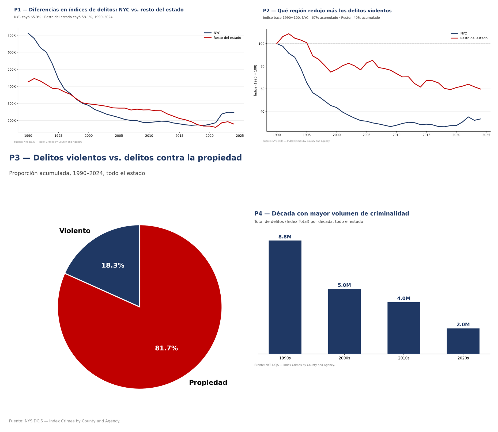
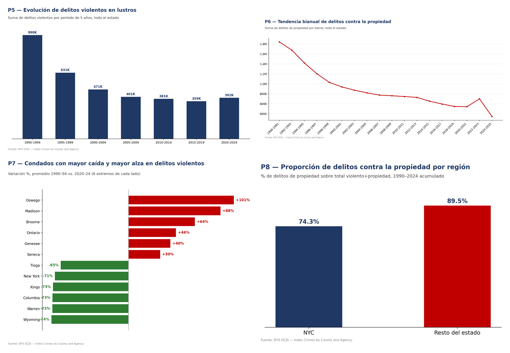
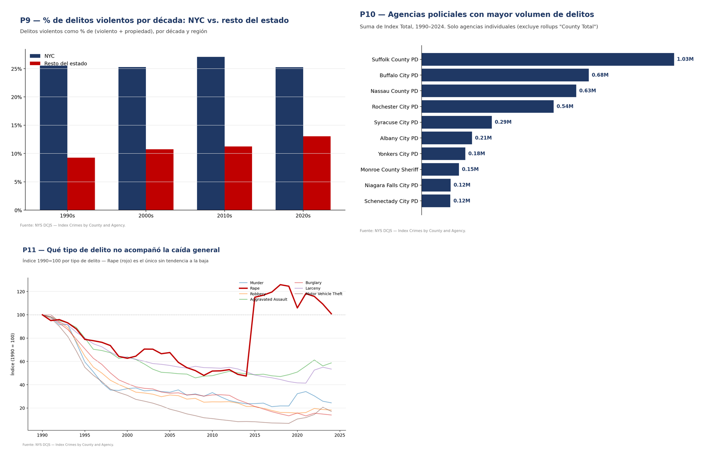

# Análisis de criminalidad en el Estado de Nueva York (1990–2024)

Data warehouse dimensional sobre 35 años de reportes policiales de los 62 condados del Estado de Nueva York, construido para responder una pregunta concreta: **cómo se desplazó la criminalidad entre la Ciudad de Nueva York y el resto del estado, y qué condados se movieron a contramano de la tendencia general.**

> **Stack:** Python (pandas, SQLAlchemy) · MySQL 8 · Modelo en estrella · Power BI
> **Metodología:** HEFESTO · **Contexto:** Base de Datos II, Universidad Católica de Córdoba

---

## Resultados principales

1. La criminalidad total del estado cayó **62,7%** entre 1990 y 2024 (de 1.137.689 a 424.312 delitos anuales), pero la caída no fue homogénea: NYC bajó **65,3%** mientras que el resto del estado bajó solo **58,3%**. El resultado es que el resto del estado, pese a caer también, ganó peso relativo dentro del total: pasó de representar el 37,5% de los delitos estatales en 1990 al 41,9% en 2024.
2. La composición del delito cambió: los delitos violentos pasaron de representar el **18,4%** del total en la década de 1990 al **19,8%** en la de 2020 — un total que en el camino se redujo a menos de un cuarto de su volumen original.
3. **12 de los 62 condados (19,4%)** muestran tendencia al alza en delitos violentos en el promedio 2020–2024 frente al promedio 1990–1994, a contramano de la caída estatal. Los más marcados: Oswego (+100,6%), Madison (+87,5%) y Broome (+63,6%).

---

## La pregunta de negocio

El relato público sobre criminalidad en Nueva York se construye casi siempre sobre la ciudad. El Estado de Nueva York, sin embargo, tiene 57 condados fuera de NYC donde vive cerca de la mitad de la población, y las decisiones de asignación de presupuesto y personal policial se toman a nivel estatal.

La pregunta que guía el proyecto es si la tendencia agregada del estado oculta comportamientos divergentes a nivel condado — es decir, si asignar recursos usando el promedio estatal lleva a decisiones equivocadas en territorios específicos.

De esa pregunta madre se derivan 11 preguntas operativas que el modelo responde: diferencias NYC vs no-NYC, crecimiento relativo de delitos violentos por región, composición violento/propiedad por década, década de mayor criminalidad, evolución por lustros, tendencia bianual de delitos contra la propiedad, condados en alza y en baja, proporción de delitos contra la propiedad por región, evolución de la proporción por década y región, agencias policiales con mayor volumen, y tipos de delito con mayor incremento interanual.

---

## Los datos

| | |
|---|---|
| **Fuente** | `Index Crimes by County and Agency, Beginning 1990` — New York State Division of Criminal Justice Services (dato abierto) |
| **Registros de origen** | 23.830 filas (condado × agencia × año) |
| **Registros en la tabla de hechos** | 71.490 (23.830 × 3, por el CROSS JOIN con `dim_categoria` — ver "El modelo") |
| **Cobertura temporal** | 1990–2024 (35 años) |
| **Cobertura geográfica** | 62 condados · 884 agencias registradas (822 agencias individuales + 62 filas de total por condado, ver nota abajo) |
| **Granularidad** | Agencia × condado × año × categoría de delito |

### Limitaciones de los datos, declaradas

Cuatro cosas que el dataset **no** permite afirmar, o que exigieron una corrección antes de calcular cualquier número de este documento:

- **Son delitos reportados, no delitos cometidos.** Cambios en la tasa de denuncia o en la práctica de registro de una agencia se ven como cambios en criminalidad, y no lo son necesariamente. El caso más visible en este dataset: la violación sexual es, de los siete delitos relevados, el único cuyo conteo no cae entre 1990 y 2024 (-0,8%, contra caídas de 41% a 86% en el resto). No es un cambio en la tasa de denuncia: en 2013 el FBI amplió la definición legal de la categoría (de "carnal knowledge of a female forcibly" a una definición más amplia y neutral en género), lo que aumentó mecánicamente el conteo a partir de ese año con independencia del comportamiento de denuncia de las víctimas.
- **El dataset traía un total por condado que duplicaba los conteos si no se filtraba.** Cada condado-año tiene una fila `"County Total"` además de una fila por cada agencia individual que opera ahí. Sumar `Index Total` sobre todas las filas sin excluir el rollup contaba cada delito dos veces: lo detectamos al calcular estos números (factor de inflación ≈1,49×: 29,5 millones de delitos "ingenuos" vs. 19,8 millones reales para 1990–2024). **Este documento usa exclusivamente las filas `"County Total"` para cualquier agregado por condado, región o estado**, y las filas de agencia individual solo para el ranking de agencias. Las 13 vistas SQL del archivo `vistas_crimes_ny.sql` ya aplican este filtro (`agency_name = 'County Total'` en los agregados geográficos, excluido puntualmente en `v_top_agencias`) — la corrección quedó aplicada sobre el repositorio.
- **No hay normalización por población.** Los conteos absolutos favorecen a los condados grandes. Comparar condados entre sí requiere cruzar con datos censales, lo cual está fuera del alcance de este trabajo.
- **La granularidad mínima es anual.** Cualquier pregunta sobre estacionalidad o variación mensual es irrespondible con esta fuente.

---

## El modelo

Esquema en estrella con una tabla de hechos y cuatro dimensiones conformadas.

```
                        fact_crimes_ny
                              │
      ┌───────────────┬───────┴───────┬────────────────┐
      │               │               │                │
 dim_tiempo      dim_geografia   dim_agencia     dim_categoria
  (35 años)      (62 condados)   (884 agencias)   (violento /
                                                   propiedad /
                                                   tipo específico)
```

Dos decisiones de diseño que vale la pena justificar:

**UNPIVOT de categorías en el ETL.** La fuente viene ancha: una columna por tipo de delito. Normalizarla a formato largo contra `dim_categoria` multiplica la cantidad de filas (por eso la tabla de hechos tiene 71.490 filas y no 23.830), pero permite agregar por jerarquía de categoría (violento / propiedad / tipo específico) sin reescribir consultas cada vez que cambia el nivel de análisis. El costo en filas se paga una vez; la flexibilidad se cobra en cada consulta.

**Granularidades temporales múltiples precalculadas en `dim_tiempo`** (año, lustro, década, bienio). Las preguntas del negocio pedían cortes en esas cuatro escalas, y resolverlas en la dimensión en vez de en cada consulta evita repetir lógica de agrupamiento.

Sobre el modelo se construyeron **13 vistas analíticas** que encapsulan los cortes recurrentes y sirven de capa semántica para Power BI.

---

## Hallazgos

### 1. El resto del estado gana peso relativo, incluso cayendo

Entre 1990 y 2024 la criminalidad total del estado se redujo 62,7%, pero de forma desigual: NYC cayó 65,3% (711.556 → 246.651 delitos anuales) y el resto del estado cayó 58,3% (426.133 → 177.661). El efecto compuesto es que la participación de NYC en el total estatal bajó de 62,5% a 58,1%, mientras la del resto del estado subió de 37,5% a 41,9%. *Fuente: agregación de las filas `"County Total"` por año y región (equivalente a `v_comparativa_nyc_vs_nonyc` corregida).*

### 2. El delito violento pesa más dentro de un total mucho más chico

La proporción de delitos violentos sobre el total pasó de 18,4% en la década de 1990 a 17,3% en la de 2000, volvió a 18,4% en la de 2010 y llegó a 19,8% en la de 2020. La tendencia no es monótona década a década, pero el punto de partida y el de llegada muestran una composición más violenta, no menos, incluso con un volumen absoluto de delitos que cayó de 8,8 a 2,0 millones entre esas dos décadas. *Fuente: `v_evolucion_decada` / `v_proporcion_por_decada_region`, recalculadas sobre filas `"County Total"`.*

### 3. Doce condados se mueven a contramano de la tendencia estatal

Comparando el promedio de delitos violentos de 1990–1994 contra 2020–2024, 12 de los 62 condados subieron en vez de bajar: Oswego (+100,6%), Madison (+87,5%), Broome (+63,6%), Ontario (+45,3%), Genesee (+40,3%), Seneca (+28,3%), Montgomery (+23,1%), Jefferson (+20,5%), Oneida (+15,0%), Chautauqua (+12,1%), Hamilton (+6,9%) y Tompkins (+0,8%). Ninguno es un condado de NYC; la mayoría son condados medianos del centro y norte del estado. *Fuente: `v_tendencias_condados`, recalculada sobre filas `"County Total"`.*

### 4. Dentro de los delitos violentos, uno no acompaña la caída

De los siete tipos de delito relevados, seis cayeron entre 41% y 86% entre 1990 y 2024 (de mayor a menor caída: allanamiento, robo con violencia, robo de vehículos, homicidio, hurto, asalto agravado). La violación sexual es la única excepción: -0,8%, prácticamente plana. La explicación no es un cambio en la tasa de denuncia, sino el cambio de definición legal del FBI en 2013, que amplió la categoría y aumentó el conteo mecánicamente a partir de ese año — una discontinuidad metodológica en la serie, no una señal real de criminalidad estable. *Fuente: `v_ranking_delitos_especificos`, recalculada sobre filas `"County Total"`.*

---

## Visualizaciones

Las 11 preguntas operativas (ver "La pregunta de negocio"), respondidas con las vistas SQL corregidas:







---

## Qué decisión habilita este análisis

Dado que (a) el resto del estado, no NYC, es la región cuya participación en la criminalidad estatal está creciendo, y (b) doce condados identificables muestran una tendencia al alza sostenida en delitos violentos mientras el promedio estatal cae con fuerza, un organismo que asigna presupuesto policial estatal debería dejar de usar la tasa estatal descendente como justificación por defecto para reducir recursos de forma pareja, y en su lugar recalibrar la asignación hacia esos condados específicos usando su propia serie histórica como referencia. El efecto de ese cambio se mediría trimestralmente con la tasa de delitos violentos por condado — idealmente normalizada por población una vez incorporados datos censales — comparada contra la tendencia propia de cada condado, no contra el promedio estatal.

---

## Qué haría distinto

- ~~Corregir el doble conteo en las 13 vistas SQL.~~ **Ya corregido en las vistas.** Fue el hallazgo metodológico más importante de este trabajo: las vistas originales sumaban las filas `"County Total"` junto con las de cada agencia individual, inflando cualquier agregado por condado o estado en ~1,49× (29,5M "ingenuos" vs. 19,8M reales, 1990–2024). Se corrigió filtrando por `agency_name = 'County Total'` en los agregados geográficos sobre los 13 archivos de vistas del repositorio. **Pendiente:** el dashboard de Power BI todavía no hereda el fix — importa directo de `fact_crimes_ny` sin pasar por las vistas, así que sigue mostrando el total inflado (ver "Estado del dashboard").
- **Normalizar por población.** Cruzar con datos del censo permitiría pasar de conteos a tasas por 100.000 habitantes, que es la unidad en la que efectivamente se toman decisiones de política criminal.
- **Modelar la dimensión agencia como SCD tipo 2.** Las agencias se fusionan, se crean y cambian de jurisdicción a lo largo de 35 años. El modelo actual las trata como estáticas, lo que introduce ruido en los rankings históricos.
- **Sustituir las vistas por tablas de agregación materializadas por ETL.** MySQL no tiene vistas materializadas: las 13 vistas se recalculan en cada consulta. Con este volumen no es un problema, pero no escalaría.
- **Incorporar una fuente de contraste.** Datos de dotación policial o de presupuesto por condado permitirían pasar de describir la tendencia a intentar explicarla.

---

## Mi rol

Desarrollé el proceso ETL completo en Python (extracción, limpieza, validación de consistencia y carga a MySQL), incluyendo la transformación UNPIVOT que normaliza las categorías de delito a formato largo, y construí las 13 vistas analíticas SQL que resuelven las preguntas de negocio y funcionan como capa semántica para Power BI. El modelo dimensional y el dashboard se trabajaron de forma conjunta con el equipo.

Equipo: Matías Amuchástegui · Lucas Rodríguez Richard · Blas Sardoy
Cátedra: Gastón Emilio Severina · Julio Gutiérrez

---

## Estado del dashboard

El dashboard de Power BI (`PBICrimes.pbix`) existe pero está temporalmente removido del repositorio (sigue disponible en el historial de git). Su modelo importa directo de `fact_crimes_ny` sin pasar por las vistas SQL, por lo que no aplica el mismo filtro de corrección de doble conteo por rollups `"County Total"` que ya tienen las 13 vistas de `vistas_crimes_ny.sql` (ver "Limitaciones de los datos, declaradas"): el KPI "Total Crimes" muestra ~59M en vez de los ~19,8M reales para 1990–2024. Se va a volver a subir una vez corregido.

---

## Reproducir el proyecto

<details>
<summary>Instrucciones de instalación y ejecución</summary>

**Requisitos:** MySQL 8.0+ · Python 3.8+ · el CSV de origen

```bash
# 1. Crear el esquema
mysql --default-character-set=utf8mb4 -u root -p < creacion_tablas_crimes_ny.sql

# 2. Dependencias
pip install pandas numpy sqlalchemy pymysql

# 3. Configurar credenciales (nunca hardcodeadas)
export CRIMES_NY_DB_HOST=localhost
export CRIMES_NY_DB_PORT=3306
export CRIMES_NY_DB_USER=root
export CRIMES_NY_DB_PASSWORD=tu_password
export CRIMES_NY_DB_NAME=crimes_ny_dw
export CRIMES_NY_CSV_PATH=/ruta/al/csv   # opcional

# 4. ETL
python etl_crimes_ny_mysql.py

# 5. Vistas analíticas
mysql --default-character-set=utf8mb4 -u root -p crimes_ny_dw < vistas_crimes_ny.sql
```

Si `CRIMES_NY_DB_PASSWORD` no está seteada, el script la solicita interactivamente con `getpass`.

**Conexión desde Power BI:** Obtener datos → Base de datos MySQL → `localhost` / `crimes_ny_dw`. Importar la tabla de hechos, las cuatro dimensiones y las vistas necesarias. Las relaciones se detectan automáticamente por las claves foráneas.

</details>

<details>
<summary>Archivos del repositorio</summary>

| Archivo | Contenido |
|---|---|
| `Proyecto_Crimes_NY_HEFESTO.md` | Informe metodológico completo (4 pasos HEFESTO) |
| `creacion_tablas_crimes_ny.sql` | DDL del esquema: 7 tablas, índices, datos maestros |
| `etl_crimes_ny_mysql.py` | ETL completo con validaciones y logging |
| `vistas_crimes_ny.sql` | 13 vistas analíticas |
| `img/` | Gráficos de las 11 preguntas de negocio (individuales `01_...`–`11_...` y combinados `combinado_1`–`3` usados en este README) |

</details>

---

*Proyecto académico — Base de Datos II, Facultad de Ingeniería, Universidad Católica de Córdoba.*
